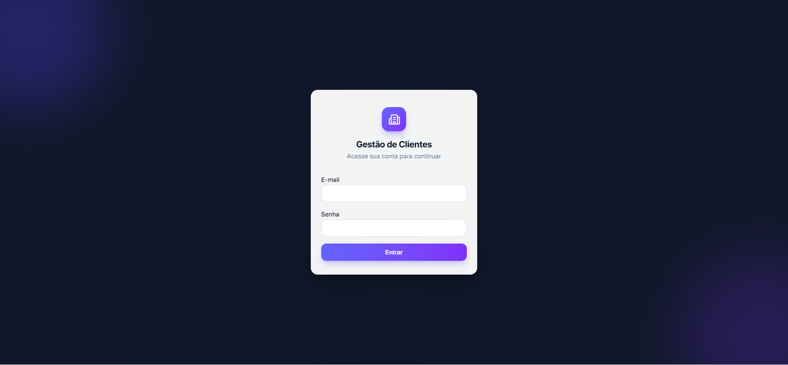
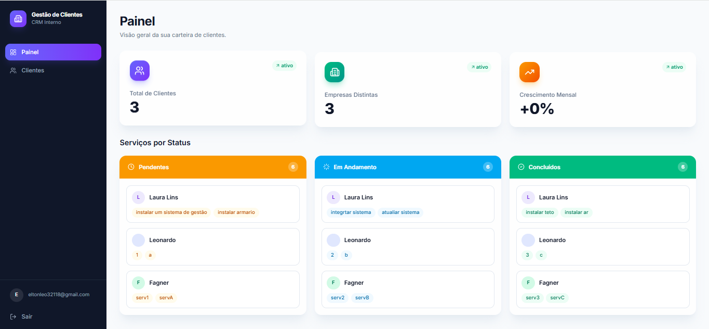
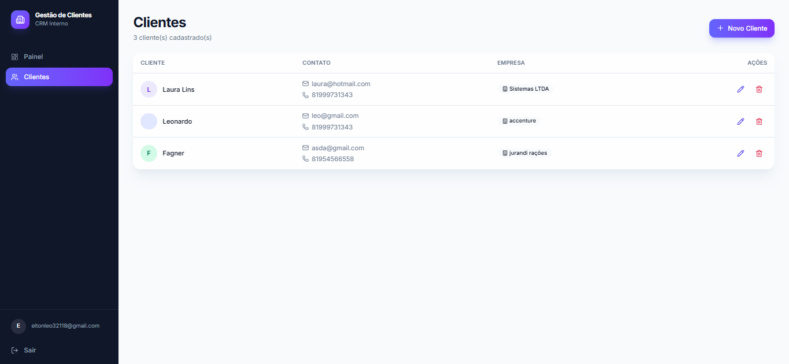
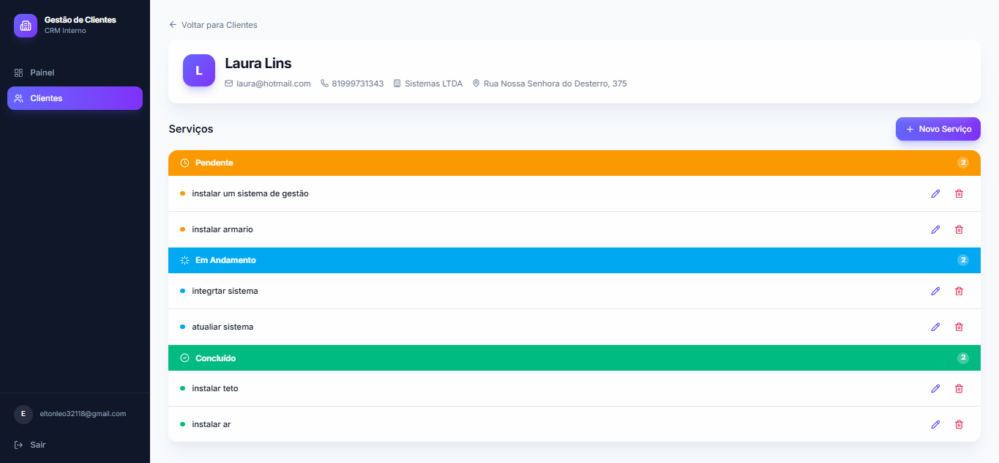
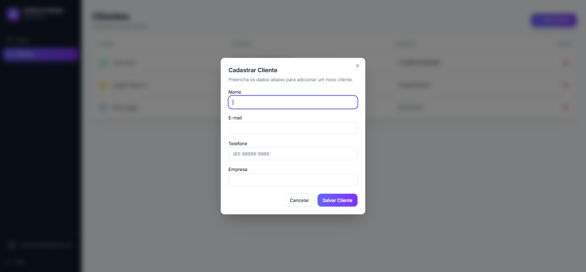
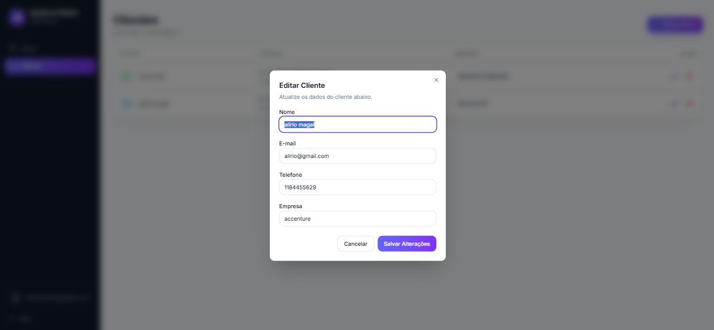
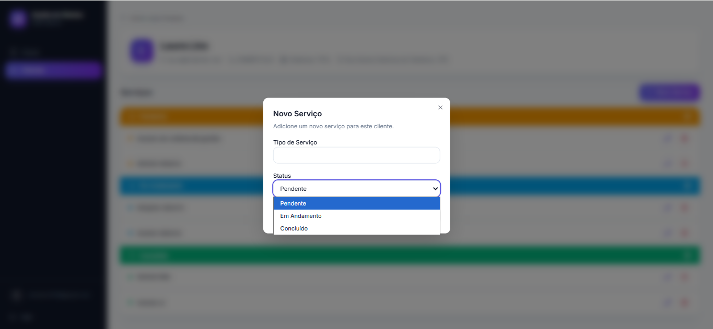
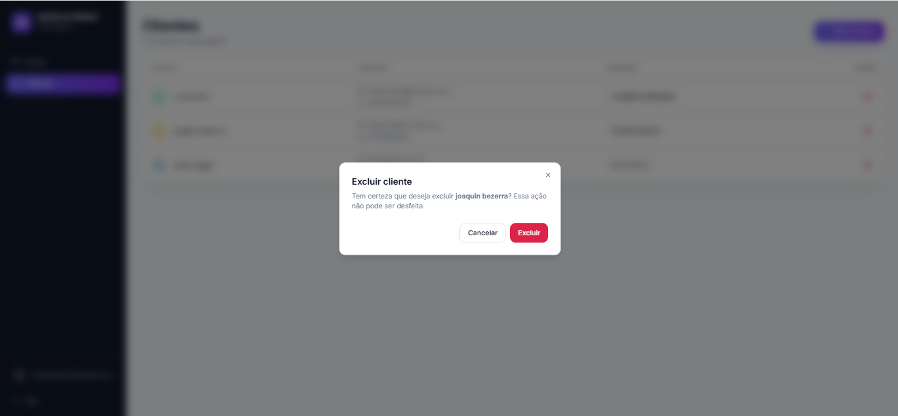
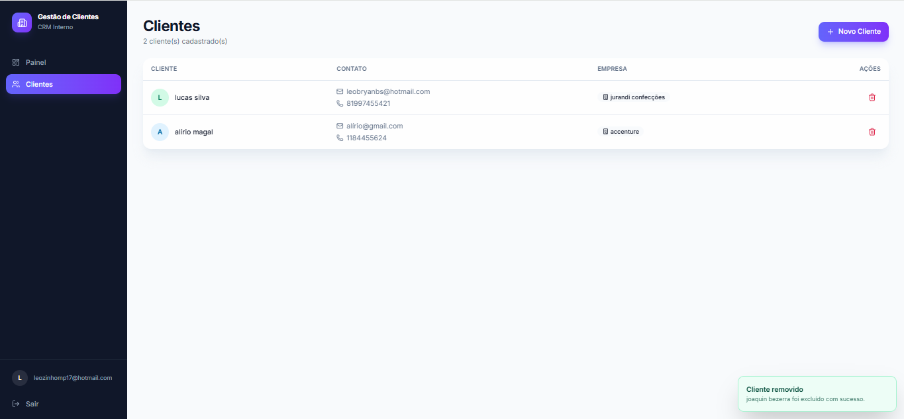

# Gestão de Clientes

Sistema de gestão de clientes (CRM) full stack, com autenticação real, dashboard de métricas e CRUD completo de clientes. Construído do zero como projeto de estudo, com commits incrementais documentando cada etapa do desenvolvimento.

🔗 **[Acessar sistema em produção](https://gestao-clientes-roan.vercel.app)**



## ✨ Funcionalidades

- 🔐 **Autenticação real** — cadastro de conta, login com senha criptografada (hash), validação no backend
- 📊 **Painel** — métricas em tempo real (total de clientes, empresas distintas)
- 👥 **Gestão de Clientes** — listagem, cadastro, edição e exclusão, com dados consumidos da API
- 📋 **Gestão de Serviços por Cliente** — cada cliente possui uma página de detalhes com serviços organizados por status (Pendente, Em Andamento, Concluído)
- 📊 **Painel Kanban de Status** — visão consolidada de todos os serviços agrupados por status e por cliente, com navegação direta para os detalhes
- ✅ **Validação de formulário** — validação de e-mail e telefone em tempo real
- 🔔 **Feedback visual** — notificações toast e modais de confirmação
- 📱 **Responsivo** — sidebar adaptável para dispositivos móveis
- 💀 **Skeleton loading** — estados de carregamento durante requisições

## 🖥️ Telas

| Painel (Kanban de Status)              | Clientes                                   |
| -------------------------------------- | ------------------------------------------ |
|  |  |

| Detalhes do Cliente e Serviços                                | Cadastro de Cliente                                       |
| ------------------------------------------------------------- | --------------------------------------------------------- |
|  |  |

| Edição de Cliente                                     | Novo Serviço                                            |
| ----------------------------------------------------- | ------------------------------------------------------- |
|  |  |





## 🚀 Stack Tecnológica

### Frontend

- **React** + **Vite**
- **Tailwind CSS v4**
- **Shadcn/ui** (componentes construídos sobre Radix UI)
- **React Router DOM** — roteamento e proteção de rotas
- **Axios** — comunicação com a API
- **Lucide React** — ícones

### Backend

- **Flask** — framework web Python
- **Flask-SQLAlchemy** — ORM
- **SQLite** — banco de dados
- **Flask-CORS** — comunicação com o frontend

## 📁 Estrutura do projeto

```
gestao-clientes/
├── backend/
│   ├── app.py              # API Flask (rotas, model, config do banco)
│   └── requirements.txt
└── frontend/
    └── src/
        ├── components/
        │   ├── ui/          # Componentes base (Button, Card, Dialog, Table, Select...)
        │   ├── layout/      # Sidebar, Layout
        │   └── clientes/    # ClienteTable, ClienteModal, ServicoTable, ServicoModal
        ├── context/         # AuthContext, ToastContext
        ├── pages/           # Login, Registrar, Dashboard, Clientes, ClienteDetalhes
        ├── routes/          # ProtectedRoute
        └── lib/             # api.js (Axios), utils.js
```

## 🔌 API

| Método | Rota                     | Descrição                                                 |
| ------ | ------------------------ | --------------------------------------------------------- |
| POST   | `/registrar`             | Cria uma nova conta de usuário                            |
| POST   | `/login`                 | Autentica e retorna token de sessão                       |
| GET    | `/clientes`              | Lista todos os clientes                                   |
| GET    | `/clientes/:id`          | Obtém os dados de um cliente específico                   |
| POST   | `/clientes`              | Cadastra um novo cliente                                  |
| PUT    | `/clientes/:id`          | Atualiza os dados de um cliente                           |
| DELETE | `/clientes/:id`          | Remove um cliente                                         |
| GET    | `/clientes/:id/servicos` | Lista os serviços de um cliente                           |
| POST   | `/clientes/:id/servicos` | Cadastra um novo serviço para o cliente                   |
| PUT    | `/servicos/:id`          | Atualiza um serviço (inclusive o status)                  |
| DELETE | `/servicos/:id`          | Remove um serviço                                         |
| GET    | `/servicos/resumo`       | Retorna todos os serviços do usuário agrupados por status |

## ☁️ Deploy

| Camada         | Serviço           | URL                                                                        |
| -------------- | ----------------- | -------------------------------------------------------------------------- |
| Frontend       | Vercel            | [gestao-clientes-roan.vercel.app](https://gestao-clientes-roan.vercel.app) |
| Backend        | Render            | gestao-clientes.onrender.com                                               |
| Banco de dados | Render PostgreSQL | —                                                                          |

> ⚠️ Os planos gratuitos utilizados possuem limitações: o backend "dorme" após períodos de inatividade (primeira requisição pode levar ~30-50s) e o banco PostgreSQL free do Render expira periodicamente, exigindo recriação.

## ▶️ Como rodar localmente

### Pré-requisitos

- Python 3.10+
- Node.js 18+

### Backend

```bash
cd backend
python -m venv venv
venv\Scripts\activate        # Windows
# source venv/bin/activate   # Mac/Linux

pip install -r requirements.txt
python app.py
```

O backend sobe em `http://127.0.0.1:5000`.

### Frontend

Em outro terminal:

```bash
cd frontend
npm install
npm run dev
```

O frontend sobe em `http://localhost:5173`. As requisições para `/api/*` são redirecionadas automaticamente para o backend via proxy do Vite.

## 🗺️ Roadmap

Funcionalidades mapeadas para próximas iterações:

- [ ] Recuperação de senha
- [ ] Busca e filtros na listagem
- [ ] Testes automatizados (pytest / React Testing Library)
- [ ] Banco de dados persistente sem expiração (upgrade de plano)

## 📝 Sobre o desenvolvimento

Este projeto foi construído com commits incrementais, cada um representando uma etapa concreta do desenvolvimento — desde a configuração do ambiente virtual até o polimento visual final. O histórico completo de commits documenta a evolução do sistema, do backend ao frontend.

---

Desenvolvido por [Leonardo](https://github.com/elton-leonardo-mp)
